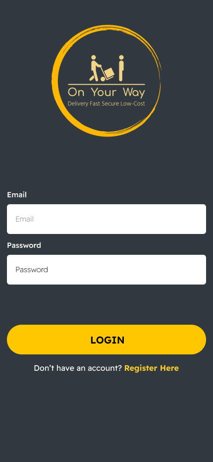
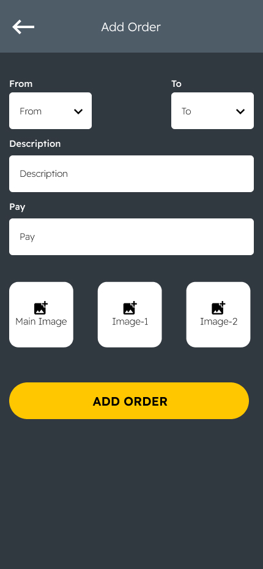
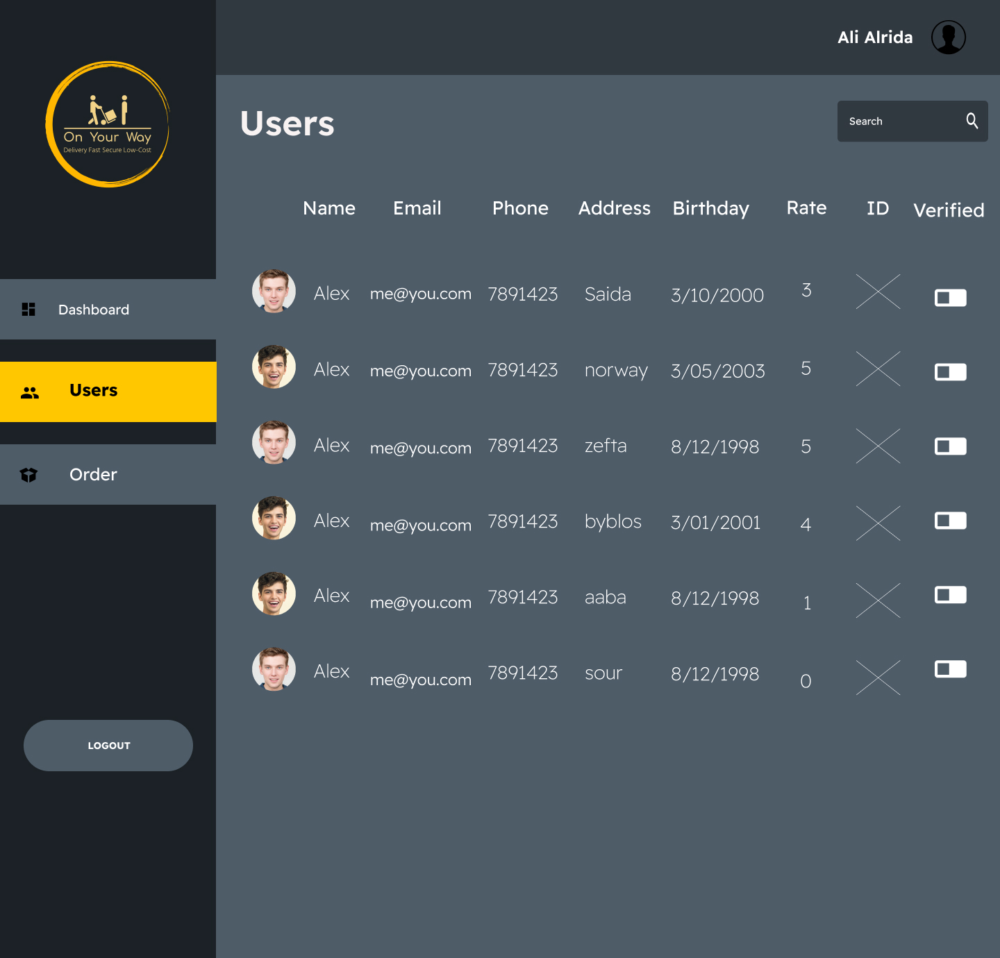
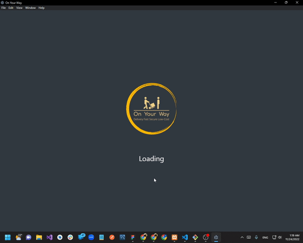
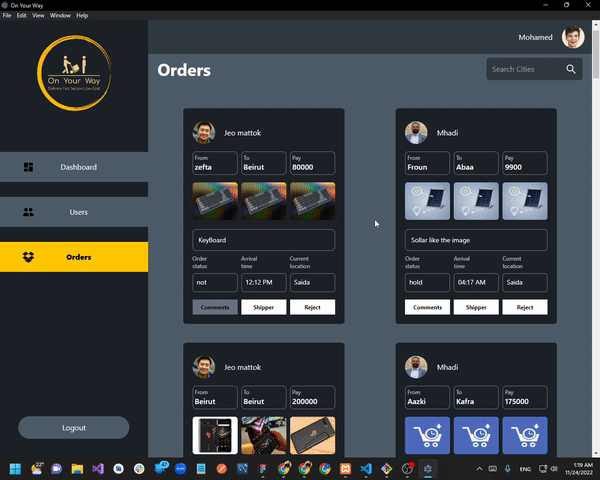

<div align="center">

>A Fast Low-Cost Local Delivery app,An app that eases the communication process between the delivery personnel and
the customer by allowing them to connect from different cities.

**[PROJECT PHILOSOPHY](https://github.com/aliShouman0/on-your-way#-project-philosophy) • [WIREFRAMES](https://github.com/aliShouman0/on-your-way#-wireframes) • [TECH STACK](https://github.com/aliShouman0/on-your-way#-tech-stack) • [IMPLEMENTATION](https://github.com/aliShouman0/on-your-way#-impplementation) • [HOW TO RUN?](https://github.com/aliShouman0/on-your-way#-how-to-run)**

</div>

<br><br>


> The Idea is that anyone who is going from one city to another by car or even public transportation can pick up orders from other customers in the apps. "Customer" refers to the person who is using the app and needs to receive an order at the exact location as the delivery person is going to.
>
> At least some of the delivery person's transportation costs can be recovered from the customer, "they can negotiate about it or do it for free as a favor."

### User Stories

- As a user, I want to receive my order fast, so that I can test it without waiting a lot
- As a user, I want to get more income, so that I can save money
- As a user, I want to benefit my time and help people, so that I can feel better

<br><br>


> This design was planned before on paper, then moved to Figma app for the fine details.
> Note that i didn't use any styling library or theme, all from scratch and using pure css modules

| Login                              | MyOrder                                        | Add order                                       |
| ---------------------------------- | ---------------------------------------------- |  ----------------------------------------------- |
|  |          |  |

| Order                                        | History                                | Account                                | 
| -------------------------------------------- | -------------------------------------- | -------------------------------------- | 
|            |  |  | 

 
 | Chat                                        | In Chat                                       | Location                                
 | ------------------------------------------- | --------------------------------------------- | --------------------------------------  
 |              |         | 

> Bottom Sheet

| Cancel Order                                       | Received order                                       | Order Completed                                       | Order Details                                         |
| -------------------------------------------------- | ---------------------------------------------------- | ----------------------------------------------------- | ----------------------------------------------------- |
|  |  |  |  |

>## Admin

| Users                                         | Orders                                           |
| ----------------------------------------------- | ---------------------------------------------- |
|  |  |


<br><br>


Here's a brief high-level overview of the tech stack the On Your Way app uses:

- This project uses the [React Native app development framework](https://reactnative.dev/). React Native is a cross-platform hybrid app development platform which allows us to use a single codebase for apps on mobile, desktop, and the web.

- This project use [Expo CLI](https://expo.dev/). Expo CLI is built on top of React Native and it is the fastest way to set up your react native project.

- For Admin user we have a [Desktop Application using Electron JS](https://www.electronjs.org/). Electron JS is a runtime framework that allows the user to create desktop applications with HTML5, CSS, and JavaScript.

- In parallel with Electron JS for admin, this project uses [React JS](https://reactjs.org/) for the front end.React is a JavaScript library for building user interfaces as a single-page application, and it allows the creation of reusable UI components.And For Designing admin we use [Tailwind](https://tailwindcss.com/). Tailwind CSS is a framework for quickly building and customizing applications .

- For Admin stats this project uses [Chart.js](https://www.chartjs.org/). Chart.js is a free, open-source JavaScript library for data visualization

- This Project uses a [Firebase real-time database](https://firebase.google.com/products/realtime-database) for chatting to have live chat.The Firebase Realtime Database is a cloud-hosted NoSQL database that lets you store and sync data between your users in realtime.

- This project uses for Backend [Laravel web application framework](https://laravel.com/).Laravel is a PHP web framework intended for the development of web applications following the model–view–controller (MVC) architectural pattern.

- For Database this project uses [MySQL database](https://www.mysql.com/). MySQL is an open-source relational database management system (RDBMS) that is based on Structured Query Language (SQL). RDBMS is a software or service used to create and manage databases based on a relational model.


<br><br>


> Using the above mentioned tech stacks and the wire frames build with figma from the user stories we have, the implementation of the app is shown as below, these are screenshots from the real app

| Login                                 | MyOrder                                          | Add order                                          |
| ------------------------------------- | -------------------------------------------------| -------------------------------------------------- |
|   |         |  |

| Order                                           | Chat                                           | In Chat                                          |
| ----------------------------------------------- | ---------------------------------------------- | ------------------------------------------------ |
|            |  |  |

>

| Order Details && App OverView                | cancel order                                    |
| -------------------------------------------- | ----------------------------------------------- |
|  |  |

| Received order                                         | Location                                    |
| ------------------------------------------------------ | ------------------------------------------------------- |
|  |  |

>Admin

| Users                                         | Orders                                  |
| ----------------------------------------------| ----------------------------------------- |
|  |  |

<br><br>


> To get a local copy up and running follow these simple example steps.


## Prerequisites
 

- Install NPM from: [NPM](https://nodejs.org/en/download)

- Install composer from: [Composer](https://getcomposer.org/download)

- Database server: Any Apache HTTP Server, MariaDB database server, recommended [XAMPP](https://www.apachefriends.org)


## Installation

### First, Cloning and Installing Packages

_Below are the steps to follow to run the project_
 
1. Clone the repo
   ```sh
   git clone https://github.com/aliShouman0/on-your-way.git
   ```
2. Install NPM packages for admin electron by opening terminal in `on-your-way-admin` and run
   ```sh
   npm install
   ```
3. Install NPM packages for user react native by opening terminal in `on-your-way-user` and run
   ```sh
   npm install
   ```
4. Install Composer packages  for server   by opening terminal in `on-your-way-server` and run
   ```sh
   composer install
   ```
   Or if error occurs  
    ```sh
   composer update
   ```
### Second, let's start the server  

In `on-your-way-server`:

1. Copy `.env.example` file and rename it `.env` you can run
   ```sh
   cp .env.example .env
   ```
2. Open your `.env` file and change the database name (DB_DATABASE) to whatever you need or to `onyourway_db`, username (DB_USERNAME) and password (DB_PASSWORD) field correspond to your configuration if you configured them.

3. Run the following command for larval ,JWT and Data Base  (you must have your XAMPP server running)
   ```sh
      php artisan key:generate
   ```
   ```sh
      php artisan jwt:secret
   ```
   ```sh
      php artisan migrate
   ```
   ```sh
      php artisan storage:link
   ```
   ```sh
      php artisan serve --host <YOUR_LOCAL_IPv4@> --port 8000
   ```
   you can get your IPV4@ by running 

   on windows 

   ```sh
      ipconfig
   ```
   on linux

   ```sh
      ifconfig 
   ```

### Now the Admin part

Go to `on-your-way-admin`:

1. In `\src\constants\constants.js` change IP to you IPV4@ or server IP@

   ```js
   BASE_URL = "SERVER_IP@/api/ony";
   BASE_STORAGE = "SERVER_IP@/storage";
   ```
2. In The Terminal Run 

   ```sh
     npm run electron:serve
   ```

### Finally for User Application 

In `on-your-way-user` :

1. Copy "or Create" `.env.example` file and rename it `.env` you can run
   ```sh
   cp .env.example .env
   ```
2. Add Server IP@ /Link
   ```js
      BASE_URL=<SERVER_IP>/api/ony
   ```
3. Add Your API Google Maps Key, You can follow [Maps JavaScript API](https://developers.google.com/maps/documentation/javascript/get-api-key) to learn how to get one

   ```js
      GOOGLE_MAPS_APIKEY=<YOUR_KEY>
   ```
4. Go to [Firebase](https://firebase.google.com/), create a project and create real-time data base.

5. Add Your Firebase Configuration,Just copy all your the configuration to `.env`
     ```js 
      API_KEY=  
      AUTH_DOMAIN=  
      PROJECT_ID=  
      STORAGE_BUCKET=  
      MESSAGING_SENDER_ID= 
      APP_ID= 
      MEASUREMENT_ID=  
    ```
6. In `\app\config\main.js` change IP to you IPV4@ or server IP@
   ```js 
      const baseUrl = "SERVER_IP@/api/ony";
      const baseLink = "SERVER_IP@/storage/";
   ```

7. In The Terminal Run 

   ```sh
     npm start
   ```
<br> 

> - ## _Congratulations, the App Must be Working Now._    

<br> 

> ## Note
- Some Installation may be different on different OS.
- The app was never tested on an ios devises .


